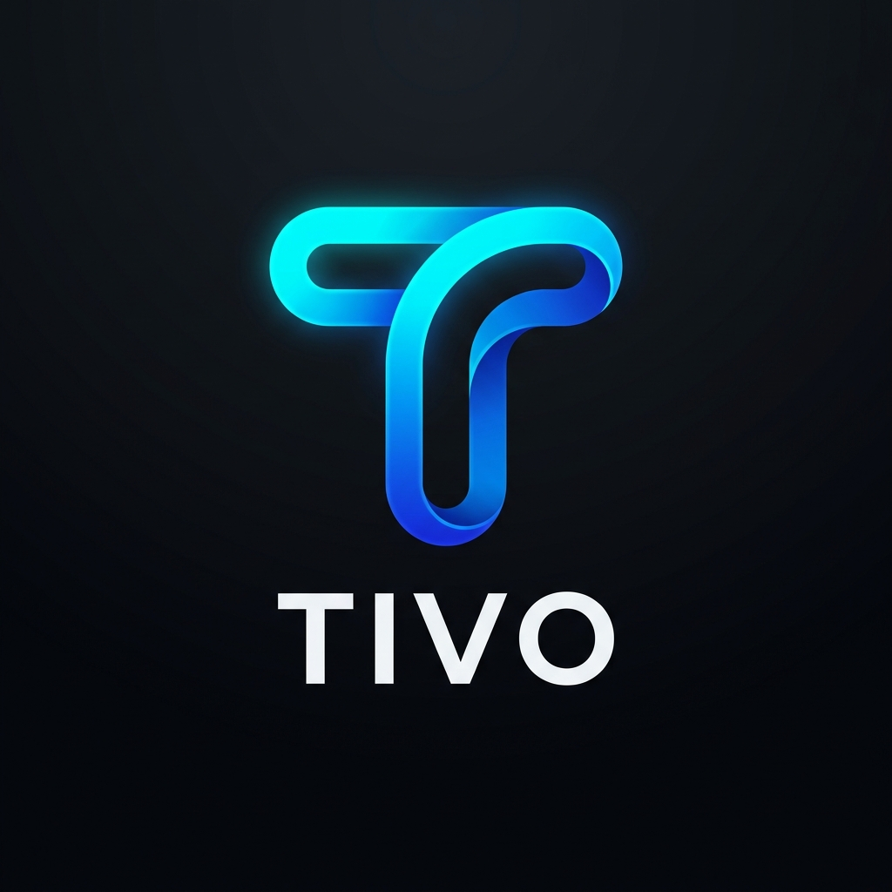

<div align="center">

  

  # 🚀 Tivo — Tu Asistente Inteligente de Finanzas Personales

  **Transforma tu gestión financiera de hojas de cálculo aburridas a una experiencia visual interactiva, intuitiva y premium.**

  [](https://flutter.dev)
  [](https://dart.dev)
  [](#-arquitectura-del-proyecto)
  [](https://riverpod.dev)
  [](#)

</div>

---

## 📑 Tabla de Contenidos

- [✨ Propósito del Proyecto](#-propósito-del-proyecto)
- [🎨 Sistema de Diseño (Glassmorphism Dark Mode)](#-sistema-de-diseño-glassmorphism-dark-mode)
- [📱 Módulos y Funcionalidades](#-módulos-y-funcionalidades)
- [🛠️ Stack Tecnológico](#️-stack-tecnológico)
- [📂 Arquitectura del Proyecto](#-arquitectura-del-proyecto)
- [🚀 Instalación y Configuración](#-instalación-y-configuración)
- [🗺️ Hoja de Ruta (Roadmap)](#️-hoja-de-ruta-roadmap)

---

## ✨ Propósito del Proyecto

**Tivo** es una aplicación moderna de finanzas personales, gestión patrimonial y educación financiera. Su objetivo es brindarle al usuario el control completo sobre su dinero en tiempo real, ofreciendo:

- 📊 **Panorámica Financiera Clara:** Visualización inmediata del patrimonio neto, salud financiera (*Tivo Score*) y *Financial Runway*.
- 💸 **Control de Dinero Sin Esfuerzo:** Registro rápido de ingresos, gastos y presupuestos categorizados.
- 🔔 **Automatización de Pagos:** Recordatorio proactivo de servicios, suscripciones y fechas de corte de tarjetas.
- 🎓 **Educación y Hábitos:** Píldoras educativas diarias, retos de ahorro y calculadoras financieras.

---

## 🎨 Sistema de Diseño (Glassmorphism Dark Mode)

El estilo visual de **Tivo** destaca por su estética futurista y pulida basada en **Glassmorphism (Efecto Vidrio Esmerilado)** sobre un tono *Deep Navy*.

### 🔵 Paleta de Colores (`TivoColors`)

| Tipo | Nombre | Código HEX | Aplicación |
| :--- | :--- | :--- | :--- |
| **Fondo Principal** | `bgDeepNavy` | `#070E22` | Fondo oscuro profundo de la aplicación |
| **Efecto Cristal** | `glassOverlay` | `#1A233A` (40% Opacidad) | Tarjetas, modales y contenedores principales |
| **Acento Primario** | `primaryIceBlue` | `#A3C2FA` | Títulos principales y botones primarios |
| **Acento Activo** | `accentElectricCyan` | `#00F0FF` | Chips activos, selecciones y destacadores |
| **Acento Secundario** | `accentNeonCyan` | `#00C2FF` | Botones de acción flotantes (FAB) |
| **Acento Educación** | `accentPurple` | `#8B5CF6` | Sección de tips, hábitos y recompensas |
| **Estado Positivo** | `statusIncomeGreen` | `#10B981` | Ingresos, porcentajes positivos y ahorros |
| **Estado Negativo** | `statusExpenseRose` | `#F43F5E` | Gastos, presupuestos excedidos y deudas |
| **Advertencia** | `statusWarningAmber` | `#F59E0B` | Recordatorios próximos y límites de gasto |

---

## 📱 Módulos y Funcionalidades

### 1. 📊 Dashboard (Panel Principal)
- **Tarjeta Patrimonio Neto Glassmorphism:** Muestra la suma total de saldos de cuentas descontando las deudas activas.
- **Tivo Score (Health Meter):** Gauge interactivo (0 - 100) que mide la salud financiera en función del % de ahorro y control de deudas.
- **Tarjetas KPI Rápidas:**
  - `Safe-to-Spend`: Muestra el monto seguro disponible para gastar hoy.
  - `Financial Runway`: Calcula cuántos meses puede subsistir el usuario en caso de perder sus ingresos.
- **Gráfico de Flujo de Caja:** Comparativa mensual de Ingresos vs. Gastos con `fl_chart`.
- **Carousel de Cuentas:** Vista horizontal de cuentas de débito, crédito y efectivo.

### 2. 💸 Finanzas y Movimientos
- **Historial de Transacciones:** Lista interactiva filtrable (*Todos, Gastos, Ingresos, Fijos*).
- **Gestión de Cuentas e Instrumentos:** CRUD de tarjetas de crédito (cupo total vs disponible), cuentas bancarias y efectivo.
- **Presupuestos Inteligentes:** Control por categoría con alertas por cambio de color (*Verde $\to$ Ámbar $\to$ Rojo*).
- **Calendario Financiero:** Integración con `table_calendar` marcando días con movimientos o fechas de corte.

### 3. 🔔 Recordatorios y Metas de Ahorro
- **Servicios y Pagos Fijos:** Gestión de recibos (luz, agua, internet, suscripciones) con botón de pago rápido *1-Tap*.
- **Control de Tarjetas:** Alertas de fechas límite y simulador de *Pago Mínimo vs. Pago Total*.
- **Metas de Ahorro Programado:** Creación de objetivos (ej. "Fondo de Emergencia", "Viaje") con seguimiento de progreso en porcentaje.

### 4. 🎓 Tivo Academy (Tips & Hábitos)
- **Píldoras Financieras:** Consejos diarios deslizables sobre regla 50/30/20, gastos hormiga, etc.
- **Retos de Ahorro:** Desafíos interactivos como el *Reto de las 52 semanas*.
- **Calculadora de Interés Compuesto:** Simulador gráfico para proyectar el crecimiento de inversiones a largo plazo.

### 5. ⚙️ Configuraciones & Seguridad
- **Moneda Global:** Cambio dinámico entre COP (\$USD, €EUR).
- **Seguridad:** Autenticación biométrica o PIN mediante `local_auth`.
- **Soporte Multilenguaje:** Preparado para Español e Inglés.

---

## 🛠️ Stack Tecnológico

- **Framework:** [Flutter 3.47.0](https://flutter.dev) / Dart 3.13.0
- **Gestión de Estado:** [Riverpod 2.6](https://riverpod.dev) (`flutter_riverpod`)
- **Enrutamiento:** [GoRouter 17.5](https://pub.dev/packages/go_router)
- **Gráficos & Métricas:** [fl_chart 1.2](https://pub.dev/packages/fl_chart)
- **Iconografía:** [Lucide Icons](https://pub.dev/packages/lucide_icons_flutter) & Cupertino Icons
- **Tipografía:** [Google Fonts](https://pub.dev/packages/google_fonts) (*Plus Jakarta Sans / Inter*)
- **Animaciones:** [flutter_animate](https://pub.dev/packages/flutter_animate)
- **Persistencia:** `shared_preferences` & `uuid`
- **Autenticación Biométrica:** `local_auth`

---

## 📂 Arquitectura del Proyecto

El código está estructurado siguiendo los principios de **Clean Architecture** orientada a características (**Feature-Driven Architecture**):

```text
lib/
├── core/
│   ├── constants/       # TivoColors, Spacing, Assets
│   ├── providers/       # Providers globales (Moneda, Idioma, Seguridad)
│   ├── theme/           # Configuración de Tema Glassmorphism
│   ├── utils/           # Formateadores de moneda, fecha y validadores
│   └── widgets/         # Componentes reutilizables (GlassCard, TivoButton, TivoScoreGauge)
└── features/
    ├── accounts/        # Módulo de cuentas de banco y tarjetas
    ├── auth/            # Módulo de autenticación (LockScreen / PIN)
    ├── budgets/         # Módulo de presupuestos por categoría
    ├── dashboard/       # Vista principal, KPI cards y gráficos
    ├── habits/          # Tips educativos, retos y calculadora financiera
    ├── main_layout/     # Navegación inferior (BottomNavigationBar)
    ├── reminders/       # Control de pagos fijos y recordatorios
    ├── savings/         # Objetivos y metas de ahorro
    ├── settings/        # Pantalla de configuración general
    ├── shared_finances/ # Dividir gastos (Split bill)
    └── transactions/    # Historial y registro de ingresos/gastos
```

---

## 🚀 Instalación y Configuración

### Prerrequisitos

- **Flutter SDK:** $\ge$ 3.13.0
- **Dart SDK:** $\ge$ 3.0.0
- **Git**

### Pasos para ejecutar localmente

1. **Clonar el repositorio:**
   ```bash
   git clone git@github.com-juansadigital:JuansaDigital/Tivo.git
   cd Tivo
   ```

2. **Obtener las dependencias:**
   ```bash
   flutter pub get
   ```

3. **Ejecutar en la plataforma deseada:**

   - **Chrome (Web):**
     ```bash
     flutter run -d chrome
     ```
   - **Dispositivo Android / Emulador:**
     ```bash
     flutter run -d android
     ```
   - **Windows Desktop:**
     ```bash
     flutter run -d windows
     ```

---

## 🗺️ Hoja de Ruta (Roadmap) y Estado Actual

Para ver el desglose exhaustivo de todos los módulos y tareas técnicas, consulta el **[CHECKLIST.md](CHECKLIST.md)**.

- [x] Arquitectura base Feature-Driven y sistema de diseño Glassmorphism Dark Mode.
- [x] Dashboard interactivo con métricas clave (*Safe-to-Spend*, *Financial Runway*, *Tivo Score*, Cashflow Chart dinámico).
- [x] CRUD completo de transacciones, presupuestos por categoría, cuentas e instrumentos y calendario financiero.
- [x] Módulo de Metas de Ahorro y aportes periódicos/extra.
- [x] Módulo de Recordatorios con flujo de pago rápido *1-Tap Pay* (débito y registro automático).
- [x] Tivo Academy con píldoras educativas, retos de ahorro y calculadora de interés compuesto.
- [x] Autenticación con Google Sign-In, Firebase Auth, Email/Password y Modo Invitado offline.
- [x] Onboarding interactivo de perfil financiero y generación automática de ingresos base.
- [x] Suite completa de Seguridad y Privacidad (Biometría Face ID/Touch ID, PIN dinámico, Modo Privacidad y Auto-bloqueo).
- [x] Sistema multi-moneda ($ COP, $ USD, € EUR) y soporte bilingüe reactivo (Español / Inglés).
- [x] Persistencia local reactiva con `SharedPreferences` y arquitectura preparada para Cloud Firestore.
- [x] Suite de pruebas automatizadas (11/11 tests pasando en unit y widget tests).
- [ ] Sincronización en tiempo real con Cloud Firestore multi-tenant.
- [ ] Exportación de reportes mensuales en PDF y CSV.
- [ ] Notificaciones push locales de recordatorios y fechas de corte.
- [ ] Widgets interactivos para pantalla de inicio (Android / iOS).

---

<div align="center">

  Desarrollado con ❤️ por **[JuansaDigital](https://github.com/JuansaDigital)**

</div>
